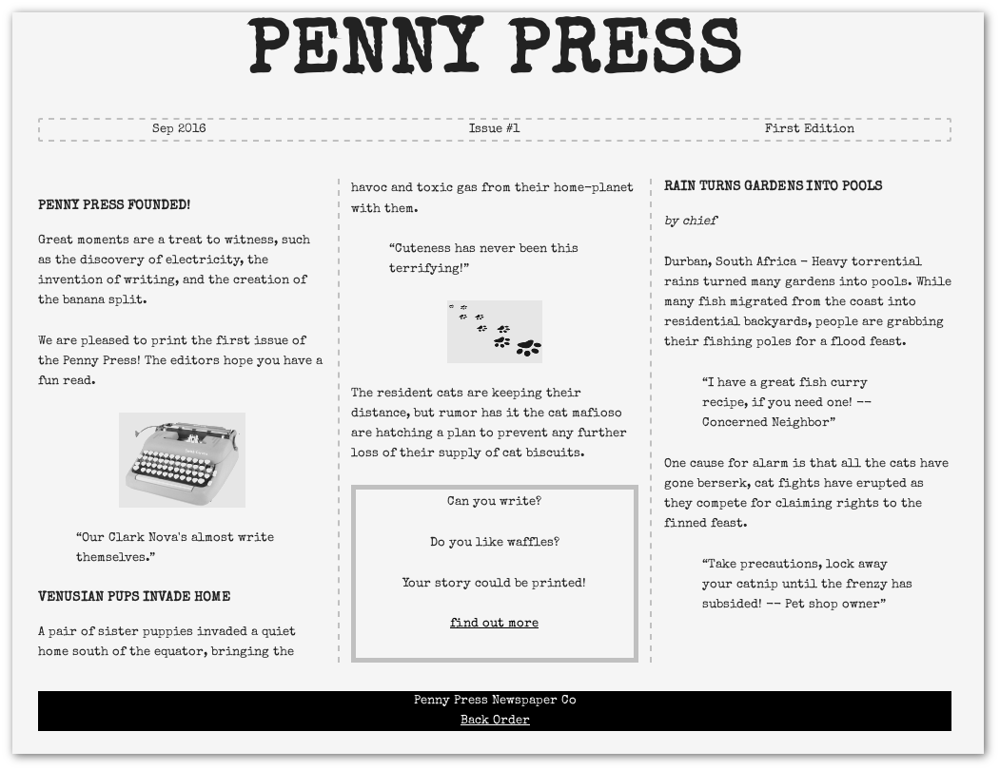

# Penny Press

Penny press shows tabloid style news. It is a single page web application for displaying articles in a columnar like fashion.

It is also a static site with no database backend. Articles are markdown (.md) files, with JSON describing each issue's articles.

## Article Structure

    .
    ├── issues
    │   ├── catalog.json        // lists issues
    │   ├── 1                   // issue directory
    │   │   ├── content.json    // lists articles
    │   │   ├── article1.md
    │   │   └── article2.md
    └── README.md

## Testing

Use docker with a temporary nginx static server, your pages are served on http://localhost:8080

    sudo docker run --rm -p 8080:80 -v /:/usr/share/nginx/html nginx:stable-alpine

## Screenshot

